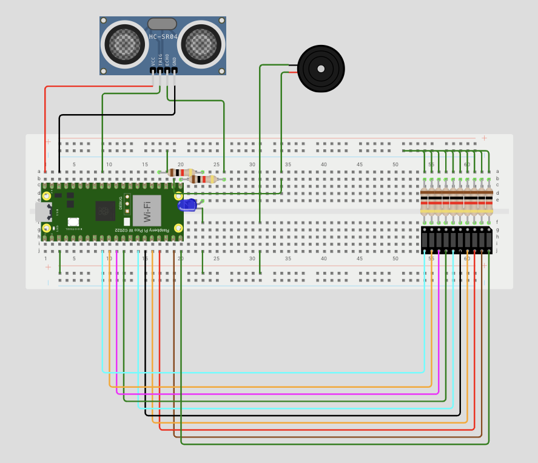
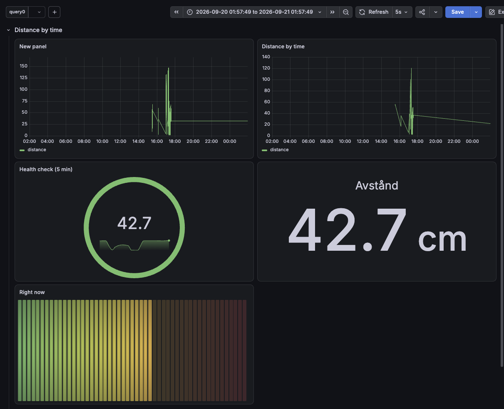
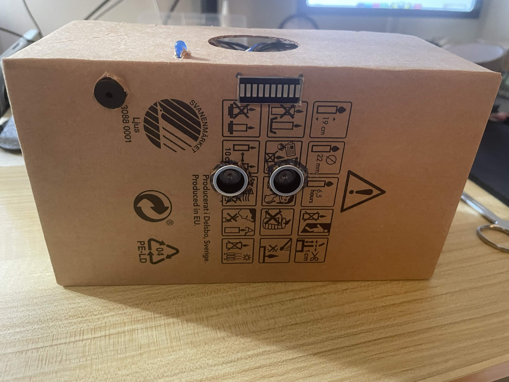
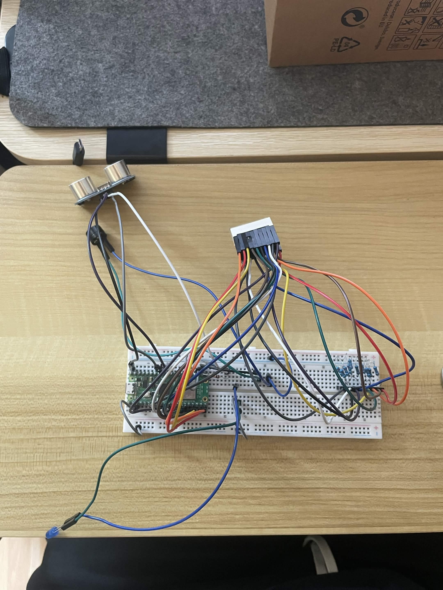

# edge_computing_project_2026
This project is a motion sensor that could be developed to diffrent products for example a parking sensor or general motion detection.

## How it works? 
1. Data Acquisition: The Raspberry Pi Pico measures the distance using the HC-SR04 sensor.
2. Data Transmission: The Pico transmits the data via Wi-Fi through an MQTT (Mosquitto) broker.
3. Data Storage: A TimescaleDB database receives and stores the data with timestamps and distance metrics.
4. Visualization: Grafana connects to the database, using SQL queries to fetch and display realtime metrics (e.g., live distance) on a dashboard.

## The compomnets used in this project is:
Raspberry pi pico 2W
- hc-sr04
- buzzer
- breadboard
- ledgraph,
- blue led,
- male/male cable
- female/male cable
- micro Usb-cable
- resistors

## Wokwi prototype

## Grafana UI:

## This is the prototype:

## This is how the prototype looks when it's not in it's chassi:

